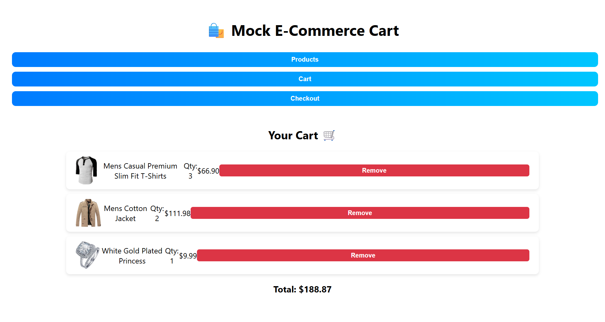
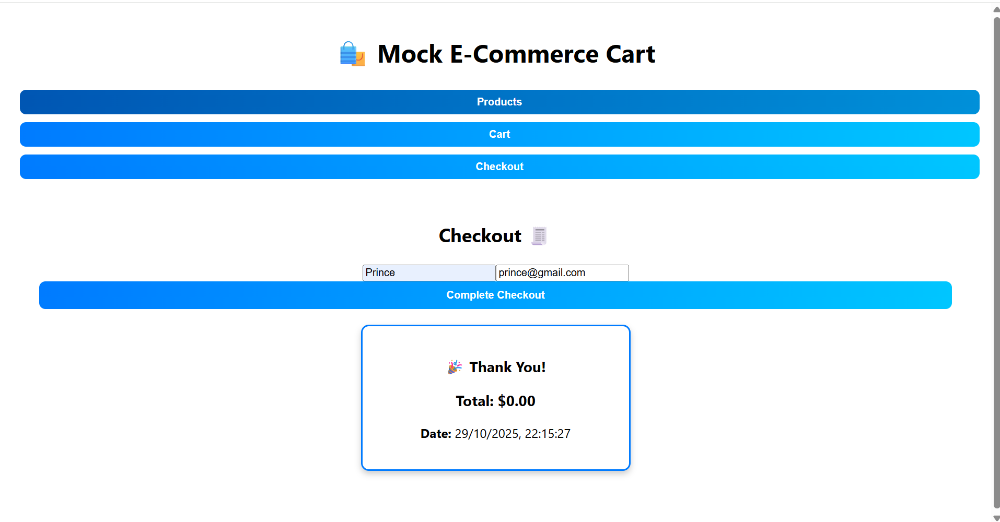

🛒 Mock E-Commerce Cart — Full Stack Project

A full-stack shopping cart app built for Vibe Commerce internship screening.

📖 Overview

This project is a mock e-commerce shopping cart application that demonstrates full-stack development skills — from RESTful API design to responsive frontend UI.

It simulates a basic shopping experience:

Browse products

Add/remove items from the cart

View totals

Perform a mock checkout (no real payments)

Everything is integrated end-to-end using React, Node/Express, and MongoDB (or SQLite).

⚙️ Tech Stack
Layer	Technology
Frontend	React.js (Vite or CRA), Axios, Context API / Redux
Backend	Node.js, Express.js
Database	MongoDB or SQLite
Tools	Git, dotenv, nodemon
🌍 Project Structure
mock-ecom-cart/
├── frontend/     # React frontend
│   ├── README.md
│   ├── src/
│   └── package.json
├── backend/      # Node + Express backend
│   ├── README.md
│   ├── routes/
│   ├── models/
│   ├── server.js
│   └── package.json
└── README.md     # Root overview (this file)

📁 Frontend README →

⚙️ Backend README →

🚀 Quick Start
1️⃣ Clone the repository
git clone https://github.com/callmeprinceyadav/nexora.git
cd mock-ecom-cart

2️⃣ Setup and run the backend
cd backend
npm install
npm run dev
# Backend will run on http://localhost:5000

3️⃣ Setup and run the frontend
cd ../frontend
npm install
npm run dev
# Frontend will run on http://localhost:5173 or http://localhost:3000

⚠️ Make sure the backend server is running before launching the frontend.

🧾 Features

✅ Browse a grid of products
✅ Add / remove products from the cart
✅ See cart summary and total
✅ Mock checkout with name + email
✅ Responsive design for all devices
✅ (Bonus) Database persistence & error handling

🔗 API Routes Overview
Method	Endpoint	Description
GET	/api/products	Get all mock products
POST	/api/cart	Add product to cart
GET	/api/cart	Retrieve cart items + total
DELETE	/api/cart/:id	Remove item from cart
POST	/api/checkout	Checkout and get mock receipt
🧠 Learnings

Full-stack development with REST APIs

Frontend state management (React Context / Redux)

Connecting React frontend with Node backend

Mocking checkout logic and dynamic totals

Writing cleaner, modular code in both React and Express

📸 Screenshots
Home		

	

Cart

Checkout

	

Author - 

Prince Yadav
Linkedin - callmeprinceyadav